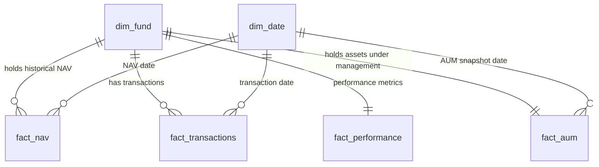

# Bluestock Mutual Fund Analytics & Database System

This repository contains the database schema, data cleaning pipelines, data generators, and a quantitative finance analytics engine designed to load, clean, analyze, and rank mutual fund schemes.

---

## 1. Project Architecture & Database Schema

The core database `bluestock_mf.db` is an SQLite database designed as a **Star Schema** to optimize transaction reporting and performance queries. 



### Table Definitions:
*   **`dim_fund` (Dimension)**: Descriptive metadata for 40 schemes (AMFI code, fund name, fund house, category, subcategory, risk grade, launch date).
*   **`dim_date` (Dimension)**: Calendar dimensions supporting day, month, year, quarter, day of week, and weekend flags.
*   **`fact_nav` (Fact)**: Daily historical Net Asset Values (NAV) for all schemes, forward-filled for weekends/holidays to ensure time-series continuity.
*   **`fact_transactions` (Fact)**: Investor ledger records containing transactional amounts, units, geography (state), and KYC verification logs.
*   **`fact_performance` (Fact)**: Trailing returns (1y, 3y, 5y) and expense ratios.
*   **`fact_aum` (Fact)**: Assets Under Management snapshots in INR Crores.

---

## 2. Quantitative Finance Methodology

The analytics engine processes the daily NAV histories and real benchmark data to calculate the following metrics:

### Daily Returns
Daily percentage change in Net Asset Value:
$$R_t = \frac{NAV_t}{NAV_{t-1}} - 1$$
Daily return distributions are validated across asset classes to verify sanity (e.g. Equity volatility vs. Debt volatility).

### Compounded Annual Growth Rate (CAGR)
CAGR measures the compounded return over a specific time horizon:
$$\text{CAGR} = \left(\frac{NAV_{end}}{NAV_{start}}\right)^{\frac{1}{n}} - 1$$
*   **1-Year CAGR**: $n = 1.0$ (2025-06-15 to 2026-06-15)
*   **3-Year CAGR**: $n = 3.0$ (2023-06-15 to 2026-06-15)
*   **5-Year CAGR (Max Available)**: $n = 4.453$ (2022-01-01 to 2026-06-15). Due to database records starting on Jan 1, 2022, the maximum available window of 4.45 years is utilized.

### Sharpe Ratio (Annualized)
Risk-adjusted return utilizing annualized compounded return and annualized daily return volatility:
$$\text{Sharpe} = \frac{\text{CAGR}_{max} - R_f}{\sigma_{\text{daily}} \times \sqrt{252}}$$
Where $R_f = 6.5\%$ (RBI repo rate proxy) and $\sigma_{\text{daily}}$ is the standard deviation of daily returns.

### Sortino Ratio (Annualized)
Risk-adjusted return penalizing only downside volatility:
$$\text{Sortino} = \frac{\text{CAGR}_{max} - R_f}{\sigma_{\text{downside}} \times \sqrt{252}}$$
Where $\sigma_{\text{downside}}$ is the downside semi-deviation:
$$\sigma_{\text{downside}} = \sqrt{\frac{1}{N} \sum_{t=1}^N \min(R_{daily, t}, 0)^2}$$

### Alpha & Beta (OLS Regression)
Ordinary Least Squares (OLS) regression of fund daily returns on Nifty 100 returns on active market trading days:
$$R_{fund, t} = \alpha_{\text{daily}} + \beta \times R_{Nifty100, t} + \epsilon_t$$
*   **Beta ($\beta$)**: Measure of systemic market risk exposure (slope).
*   **Alpha ($\alpha$)**: Annualized excess return over market benchmark (intercept):
    $$\alpha_{\text{annual}} = \alpha_{\text{daily}} \times 252$$

### Maximum Drawdown (MDD)
The peak-to-trough drop in NAV:
$$\text{Drawdown}_t = \frac{NAV_t}{\max_{s \le t} NAV_s} - 1$$
$$\text{MDD} = \min_{t} (\text{Drawdown}_t)$$
We track the exact Peak Date, Trough Date, and Recovery Date (first date NAV recovers to peak level).

### Tracking Error
Annualized standard deviation of excess daily returns relative to benchmarks (Nifty 50 and Nifty 100):
$$\text{Tracking Error} = \text{Std}(R_{fund} - R_{benchmark}) \times \sqrt{252}$$

---

## 3. Scorecard Model (0–100)

To rank the 40 mutual fund schemes, a composite scoring model is constructed using percentile ranking scores (where $100$ is the best and $0$ is the worst):

$$\text{Composite Score} = 0.30 \cdot R_{\text{3y Return}} + 0.25 \cdot R_{\text{Sharpe}} + 0.20 \cdot R_{\text{Alpha}} + 0.15 \cdot R_{\text{Expense (inv)}} + 0.10 \cdot R_{\text{Max DD (inv)}}$$

*   **$R_{\text{3y Return}}$**: Higher 3y CAGR = Higher Rank
*   **$R_{\text{Sharpe}}$**: Higher Sharpe = Higher Rank
*   **$R_{\text{Alpha}}$**: Higher Alpha = Higher Rank
*   **$R_{\text{Expense (inv)}}$**: Lower Expense Ratio = Higher Rank
*   **$R_{\text{Max DD (inv)}}$**: Smallest Drawdown (closest to 0%) = Higher Rank

---

## 4. Deliverables

*   **[Performance_Analytics.ipynb](file:///d:/BlueStock%20Finetech/Performance_Analytics.ipynb)**: Executed Jupyter notebook outlining the complete analytics pipeline, formulas, data validation checks, and visualizations.
*   **[fund_scorecard.csv](file:///d:/BlueStock%20Finetech/fund_scorecard.csv)**: Final scorecard database mapping CAGRs, Sharpe, Sortino, Alpha, Beta, Drawdowns, Score, and ranks.
*   **[alpha_beta.csv](file:///d:/BlueStock%20Finetech/alpha_beta.csv)**: Annualized alpha and beta metrics for all 40 schemes.
*   **[benchmark_comparison_chart.png](file:///d:/BlueStock%20Finetech/benchmark_comparison_chart.png)**: High-resolution chart displaying the growth of a ₹10,000 investment in the Top 5 funds versus Nifty 50 and Nifty 100 benchmarks over 3 years.

---

## 5. Summary of Findings (Top 5 Funds)

The scorecard model ranked the following funds as the top 5 performers:

1.  **HDFC Mid Cap Fund - Direct Growth (AMFI: 100002)** - Score: 87.05
2.  **ICICI Prudential Small Cap Fund - Regular Growth (AMFI: 100003)** - Score: 85.80
3.  **Kotak Mahindra Large Cap Fund - Regular Growth (AMFI: 100005)** - Score: 83.95
4.  **SBI Large Cap Fund - Regular Growth (AMFI: 100017)** - Score: 83.75
5.  **ICICI Prudential Balanced Advantage Fund - Regular Growth (AMFI: 100035)** - Score: 82.35

### Tracking Error vs Benchmarks:
*   **HDFC Mid Cap**: TE vs Nifty 50 = **22.22%** | TE vs Nifty 100 = **22.49%**
*   **ICICI Prudential Small Cap**: TE vs Nifty 50 = **21.94%** | TE vs Nifty 100 = **22.16%**
*   **Kotak Mahindra Large Cap**: TE vs Nifty 50 = **21.44%** | TE vs Nifty 100 = **21.64%**
*   **SBI Large Cap**: TE vs Nifty 50 = **21.96%** | TE vs Nifty 100 = **22.22%**
*   **ICICI Prudential Balanced Advantage**: TE vs Nifty 50 = **15.08%** | TE vs Nifty 100 = **15.33%**

---

## 6. How to Replicate Analysis

### Setup Environment:
```bash
# Create and activate virtual environment
python -m venv .venv
.venv\Scripts\activate

# Install dependencies
pip install -r requirements.txt
```

### Run Generation and DB Loader (If resetting):
```bash
# Synthesize data for 40 schemes and transactions
python generate_all_data.py

# Clean and load CSVs into SQLite
python db_loader_v2.py
```

### Regenerate Analytics:
To rebuild the CSV deliverables, benchmark chart, and pre-render the Jupyter notebook:
```bash
# Execute the quant metrics and notebook generator script
python "C:\Users\santo\.gemini\antigravity-ide\brain\288904a4-7a7a-4976-9bf1-2abed43cdd84\scratch\create_analytics_notebook.py"
```
This script will fetch Yahoo Finance index data, run all quant functions, and save the pre-rendered outputs inside `Performance_Analytics.ipynb`.
