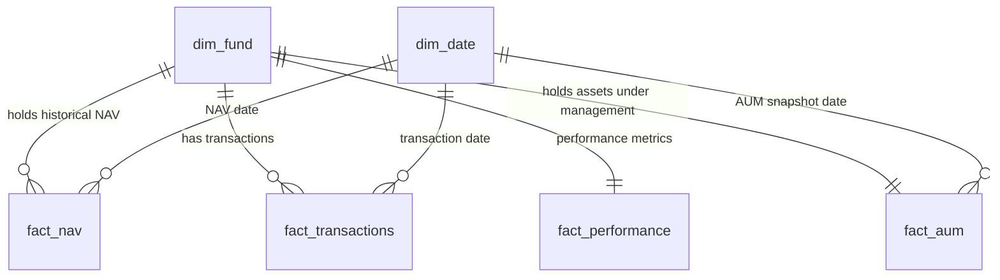

# Bluestock Mutual Fund Database Data Dictionary

This document details the database schema, tables, column specifications, business definitions, and sources for the `bluestock_mf.db` SQLite database designed as a **Star Schema**.

---

## Star Schema Overview
The database uses a Star Schema optimized for financial performance analysis and investor transaction reporting. It consists of:
*   **Dimensions**: `dim_fund`, `dim_date`
*   **Facts**: `fact_nav`, `fact_transactions`, `fact_performance`, `fact_aum`

---

## 1. Table: `dim_fund` (Dimension)
Contains descriptive metadata for each mutual fund scheme.

| Column Name | SQLite Data Type | Constraints | Description | Source Reference |
| :--- | :--- | :--- | :--- | :--- |
| `amfi_code` | `INTEGER` | `PRIMARY KEY` | Unique 6-digit identifier assigned by AMFI. | `fund_master.csv` |
| `fund_name` | `TEXT` | `NOT NULL` | The full name of the mutual fund scheme. | `fund_master.csv` |
| `fund_house` | `TEXT` | `NOT NULL` | Asset Management Company (AMC) managing the fund. | `fund_master.csv` |
| `category` | `TEXT` | `NOT NULL` | Broad asset class category (e.g. Equity, Debt). | `fund_master.csv` |
| `sub_category` | `TEXT` | `NOT NULL` | Investment style sub-category (e.g. Large Cap, Mid Cap). | `fund_master.csv` |
| `risk_grade` | `TEXT` | `NOT NULL` | Scheme risk grading as per AMFI (e.g. Very High). | `fund_master.csv` |
| `launch_date` | `TEXT` | None | The date the scheme was launched (YYYY-MM-DD). | `fund_master.csv` |

---

## 2. Table: `dim_date` (Dimension)
A standardized calendar dimension supporting flexible time-series aggregation.

| Column Name | SQLite Data Type | Constraints | Description | Source Reference |
| :--- | :--- | :--- | :--- | :--- |
| `date` | `TEXT` | `PRIMARY KEY` | Calendar date key in format (YYYY-MM-DD). | Derived from transaction & NAV logs |
| `day` | `INTEGER` | `NOT NULL` | Day of the month (1-31). | Derived |
| `month` | `INTEGER` | `NOT NULL` | Month number (1-12). | Derived |
| `year` | `INTEGER` | `NOT NULL` | Calendar Year (e.g. 2026). | Derived |
| `quarter` | `INTEGER` | `NOT NULL` | Calendar Quarter (1-4). | Derived |
| `day_of_week`| `TEXT` | `NOT NULL` | Full name of the day (e.g. Monday, Sunday). | Derived |
| `is_weekend` | `INTEGER` | `NOT NULL` | Boolean flag (1 = Saturday/Sunday, 0 = Weekday).| Derived |

---

## 3. Table: `fact_nav` (Fact)
Daily historical Net Asset Values (NAV) for each mutual fund scheme, forward-filled for weekends and holidays.

| Column Name | SQLite Data Type | Constraints | Description | Source Reference |
| :--- | :--- | :--- | :--- | :--- |
| `amfi_code` | `INTEGER` | `PRIMARY KEY`, `FOREIGN KEY` | Reference to `dim_fund(amfi_code)`. | `nav_history.csv` |
| `date` | `TEXT` | `PRIMARY KEY`, `FOREIGN KEY` | Reference to `dim_date(date)`. | `nav_history.csv` |
| `nav` | `REAL` | `NOT NULL` | Net Asset Value (NAV) price per unit on that date. | `nav_history.csv` |

---

## 4. Table: `fact_transactions` (Fact)
Investor ledger records tracking all investment inflow (subscriptions) and outflow (redemptions).

| Column Name | SQLite Data Type | Constraints | Description | Source Reference |
| :--- | :--- | :--- | :--- | :--- |
| `transaction_id` | `TEXT` | `PRIMARY KEY` | Unique transaction ID (e.g., TXN10001). | `investor_transactions.csv` |
| `investor_id` | `TEXT` | `NOT NULL` | Unique ID of the investing client. | `investor_transactions.csv` |
| `investor_name` | `TEXT` | `NOT NULL` | Name of the investor. | `investor_transactions.csv` |
| `state` | `TEXT` | `NOT NULL` | Geographical state of investor (for regional analytics). | `investor_transactions.csv` |
| `amfi_code` | `INTEGER` | `FOREIGN KEY` | Reference to `dim_fund(amfi_code)`. | `investor_transactions.csv` |
| `transaction_date`| `TEXT` | `FOREIGN KEY` | Date of the transaction (YYYY-MM-DD). Reference to `dim_date(date)`. | `investor_transactions.csv` |
| `transaction_type`| `TEXT` | `NOT NULL` | Standardised type: `SIP`, `Lumpsum`, or `Redemption`. | `investor_transactions.csv` |
| `amount` | `REAL` | `NOT NULL` | Monetary value of the transaction in INR (>0). | `investor_transactions.csv` |
| `kyc_status` | `TEXT` | `NOT NULL` | Customer KYC verification status: `Verified`, `Pending`, `Failed`.| `investor_transactions.csv` |
| `units` | `REAL` | None | Allotted units computed as `amount / NAV` on transaction date. | Computed during load |

---

## 5. Table: `fact_performance` (Fact)
Static and dynamic return summaries and expense ratio constraints for mutual fund schemes.

| Column Name | SQLite Data Type | Constraints | Description | Source Reference |
| :--- | :--- | :--- | :--- | :--- |
| `amfi_code` | `INTEGER` | `PRIMARY KEY`, `FOREIGN KEY` | Reference to `dim_fund(amfi_code)`. | `scheme_performance.csv` |
| `return_1y` | `REAL` | None | 1-Year trailing returns in percentage. | `scheme_performance.csv` |
| `return_3y` | `REAL` | None | 3-Year trailing returns in percentage. | `scheme_performance.csv` |
| `return_5y` | `REAL` | None | 5-Year trailing returns in percentage. | `scheme_performance.csv` |
| `expense_ratio` | `REAL` | None | Annual management fees charged to the fund (%). | `scheme_performance.csv` |
| `anomaly_flag` | `INTEGER` | None | Binary flag identifying performance or return data anomalies. | Derived in pipeline |

---

## 6. Table: `fact_aum` (Fact)
Assets Under Management (AUM) snapshots representing total market value managed by the scheme.

| Column Name | SQLite Data Type | Constraints | Description | Source Reference |
| :--- | :--- | :--- | :--- | :--- |
| `amfi_code` | `INTEGER` | `PRIMARY KEY`, `FOREIGN KEY` | Reference to `dim_fund(amfi_code)`. | `fund_master.csv` |
| `aum_amount` | `REAL` | `NOT NULL` | Total Assets Under Management in INR Crores. | `fund_master.csv` |
| `last_updated_date`| `TEXT` | `FOREIGN KEY` | Reference to `dim_date(date)` when AUM was last updated. | Derived (latest NAV date) |
